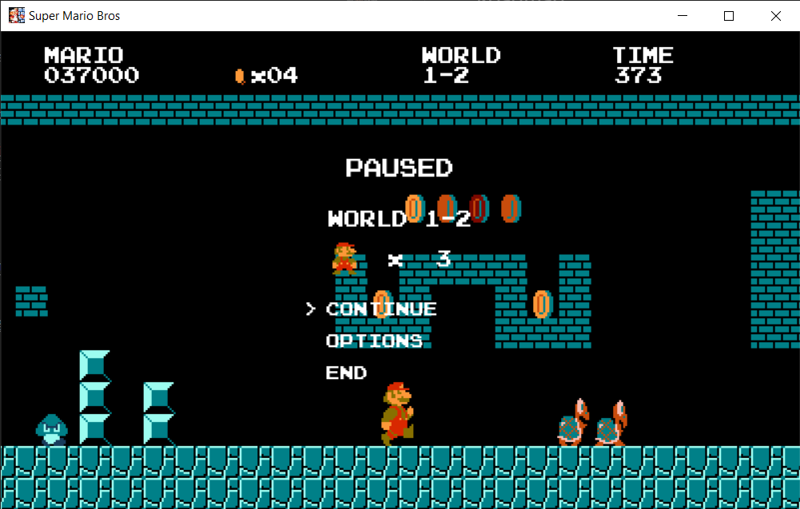
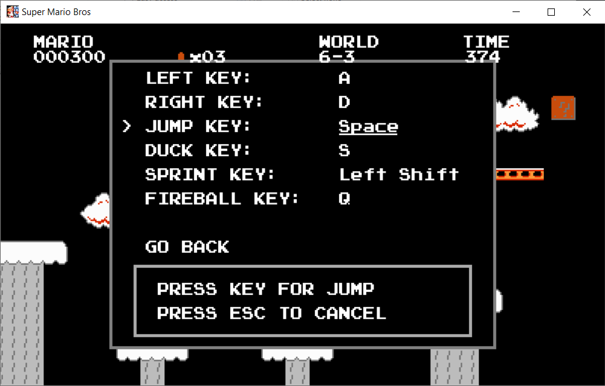
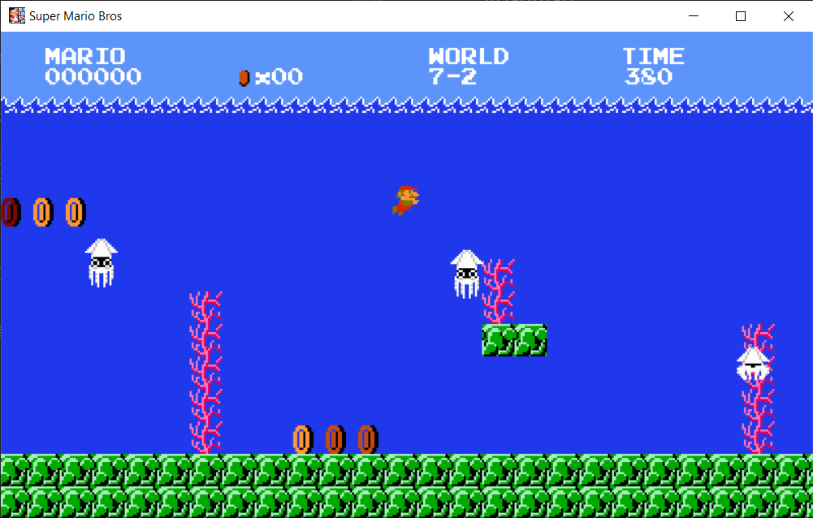
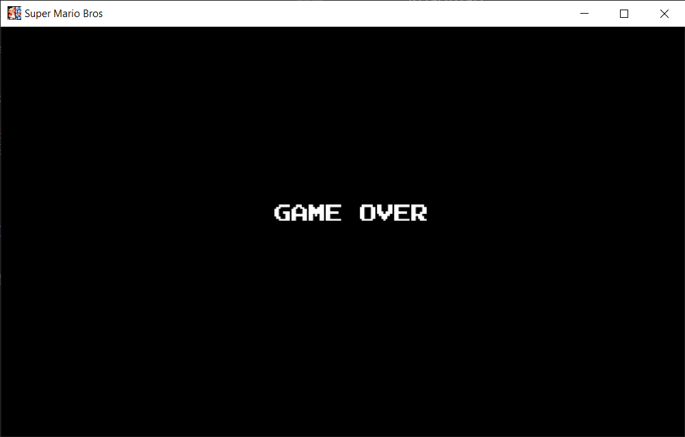

# Super Mario Bros

A recreation of the Super Mario Bros game from the Nintendo NES using C++ and the SDL2 Library

Play it online! https://gold872.github.io/games/super_mario_bros/

* *NOTE: The web build is lower quality and may contain some glitches*

## Compiling

The following libraries are required to compile and run this project
- [SDL2](https://www.libsdl.org/download-2.0.php)
- [SDL2_Image](https://www.libsdl.org/projects/SDL_image/)
- [SDL2_TTF](https://www.libsdl.org/projects/SDL_ttf/release/)
- [SDL2_Mixer](https://libsdl.org/projects/SDL_mixer/)

Once you have the zip files extracted and the dlls placed into the project directory, compile using one of the following methods

### Makefile (Recommended)

1. Open the [Makefile](Makefile)

2. Replace the areas where you see \*\*\*\*\*\*SDL2 LOCATION\*\*\*\*\*\* with the direct location of the folder for the specified library
    - If you are using windows, in the LINKER_FLAGS section, add `-lmingw32` before `$(SDL2_LINKER_FLAGS)`

3. Run the Makefile build command, `make`

    - The MinGW compiler has a different command, `mingw32-make`

### Command Line

```bash
g++ -std=c++17 -static-libgcc -static-libstdc++ -mwindows -I"include" -I"<SDL2 Location>/include" -I"<SDL2_image Location>/include" -I"<SDL2_mixer Location>/include" -I"<SDL2_ttf Location>/include" src/*.cpp src/*/*.cpp -O1 -o "Super Mario Bros" res/super_mario_bros.res -L"<SDL2 Location>/lib" -L"<SDL2_image Location>/lib" -L"<SDL2_TTF Location>/lib" -L"<SDL2_Mixer Location>/lib" -lSDL2main -lSDL2 -lSDL2_image -lSDL2_ttf -lSDL2_mixer
```
*Note: If you are on Windows and using MinGW32, you must add* `-lmingw32` *before* `-lSDL2main` *in the command*

The [bin](bin) directory contains a precompiled executable if you do not want to go through the installation and compiling process

## How it Works

### The Entities

- The Entities in this game are creating using an Entity Component System
    - Instead of having one Entity class that every Entity inherits, an Entity is a class that has nothing, but you are able to attatch components to it. Such components include:
        - Position Component
        - Texture Component
        - Moving Component

    - These Components get used by the Systems, where they find Entities with certain components, and update the Entities properly using the data from the Components.

- Entities don't only serve the purpose of displaying a texture on the screen, some are used to add properties to Entities (For example, classifying an entity as the player with the PlayerComponent), and some are also used to schedule an action (this is most commonly used in the sound and score system)

### The Commands

- Commands are used to perform actions that aren't focused on one entity. Commands are most commonly used in sequences, where multi-step processes are executed in order. Examples of this being used is the WarpCommand for warp-pipes and the VineCommand for climbing a vine.

### The Levels

- The Levels were created with the help of a program called [Tiled Map Editor](https://www.mapeditor.org/)

- After creating the Map in the Tiled Editor, they are exported as a CSV file, and then get read by the Map class, and using the IDs from the Map, the Entities get created with their needed components.

## Roadmap

- Record a demo video of the game

## Special Thanks
People that have been a huge help in developing this project with their amazing knowledge and skills
 - [Killme](https://github.com/killme)
 - [friedkeenan](https://github.com/friedkeenan/)

## Screenshots

### Main Menu


### Game


### Pause Screen


### Options


### Underwater


### Gameover
